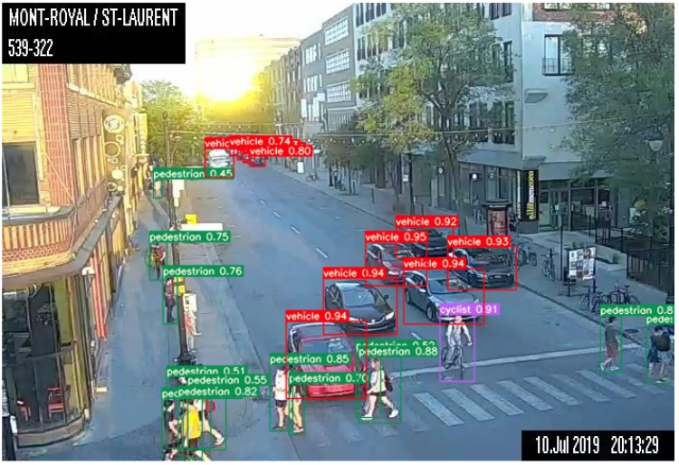

([Français](#Détection-Urbaine))
# Urban Object Detection
As part of a professional Master's internship in machine learning at [MILA](https://mila.quebec/en/), the City of Montreal developed a prototype to perform object detection on frames from a live video feed sourced on Pan-Tilt-Zoom (PTZ) traffic cameras. This prototype can detect five different classes of objects, namely: vehicles, pedestrians, construction objects, buses and cyclists.

We are publishing the results of this work by making available :

  - all the **annotated images** taken from the traffic camera video stream,
  - the **code** developed as a proof of concept for object detection in urban settings and
  - SOON available: Jean-Sébastien Grondin's **internship report** with more details about the methodology, the creation of the dataset and the results. 

The code made available is **NOT production ready** and is not maintained to that end. It is a prototype that will evolve, 
in the medium-long term, to be part of a mature system.

### Context
The [Centre de Gestion de la Mobilité Urbaine](http://www1.ville.montreal.qc.ca/banque311/content/centre-de-gestion-de-la-mobilit%C3%A9-urbaine-cgmu) (CGMU) is the heart and brain of intelligent transport systems in Montreal. On a daily basis, the CGMU is a
real-time decision-making centre that aims to facilitate
the mobility of citizens and visitors. Specialized equipment makes it possible to remotely manage traffic on the road
network and to react quickly when an incident occurs. There are, among others, over [500 traffic cameras](https://donnees.montreal.ca/ville-de-montreal/cameras-observation-routiere) installed on the
territory that help operators quickly detect road obstacles.

In order to support the work of CGMU operators, the City of Montreal wishes to set up an automatic road anomaly
detection system. This system, based on artificial intelligence, will analyze in real time the video streams
coming from the 500 cameras in order to detect various types of incidents (e.g. accidents, broken-down vehicles, obstruction on road, etc.).

We have opted for an iterative approach aimed at developing a series of proofs of concept
that we can test and integrate as the developments progress. We have chosen a modular architecture where the outputs of some models could supply the inputs of other
models. The purpose of this modularity is to provide flexibility in the use of the models and to integrate them in
contexts other than traffic and with cameras other than those available at the CGMU. A first step was taken
in this direction in 2019 with the development of a [semantic segmentation solution](https://github.com/VilledeMontreal/urban-segmentation) which can be used to generate masks and areas of interest, and could also be adapted to infer the camera position and zoom setting. This repository presents the outcome of a second project that took place in 2020, and which consisted in developing an object detection solution.

### Object Detection
The task of object detection consists in localizing and classifying objects in images amongst a list of classes. Training a model to perform this taks requires a specific type of annotations. Each training image requires bounding box coordinates for all relevant objects contained in it, along with their class label. A trained model can then be used to produce bounding box inferences for new images. The following are examples of detection on two of the CGMU test set images.


You can find the annotated dataset on the City of Montreal's [open data site](https://donnees.montreal.ca/ville-de-montreal/images-annotees-cameras-circulation). Follow the link and along with the data, you will find the methodology used for annotating the dataset, as well as the the terms of use.

It is important to note that the images we used for this project are taken from images already published on the [open data site](https://ville.montreal.qc.ca/circulation/). We made sure this data/code opening process respects the privacy of citizens. As these cameras are installed to assist CGMU operators in their traffic management, they are tuned to limit the information collected. They are therefore adjusted so that they cannot capture the faces nor the license plates. Also, even if we were able to identify a vehicle or a person (e.g. the clothes worn), it would not be possible to track its movements because the images are kept and published only at 5-minute intervals.

A review of models available in literature was undertaken at the beginning of the project. [YOLOv5](https://github.com/ultralytics/yolov5) 
was selected as the most promising model for this application, while the Single-Shot Multibox Detector (SSD) was selected 
as the baseline model. Only the code and model checkpoints relative to YOLOv5 are being released because it 
significantly outperformed the SSD. YOLOv5 was first published in May 2020 as a Pytorch implementation on Github and is still under
active development with improvements being made on a weekly basis. For this reason, commit
`bb8872e` was forked at the latest possible stage of the project, and then used for project specific
development.

### Models
The following three model variants were trained on the CGMU dataset as well as an additional 11k+ images from the [MIO-TCD dataset](http://podoce.dinf.usherbrooke.ca/challenge/dataset/). These three model variants are briefly described below. More information will be available in the report. 

  - S-512 : YOLOv5 'Small' with input image size of 512x512, dataset : CGMU training set + MIO-TCD dataset
  - X-512 : YOLOv5 'X-Large' with input image size of 512x512, dataset : CGMU training set + MIO-TCD dataset
  - X-704 : YOLOv5 'X-Large' with input image size of 704x704, dataset : CGMU training set only

The table below shows the total mean Average Precision (mAP) for each model variant, as well as the mAP for each class, on the CGMU test set:

| Models  | mAP @ 0.5 IoU |  vehicle  | pedestrian | construction | cyclist   | bus       | Latency   |
| :-------|  --------:  | --------: | --------:  | --------:    | --------: | --------: | --------: |
| S-512   | 0.753       | 0.875     | 0.701      | 0.589        | 0.780     | 0.820     | 4.2 ms    |
| X-512   | 0.820       | 0.915     | 0.788      | 0.719        | 0.829     | 0.849     | 16.6 ms   |
| X-704   | 0.861       | 0.939     | 0.828      | 0.809        | 0.838     | 0.892     | 31.0 ms   | 

**Note:** Latency calculated with an NVIDIA Tesla P100 GPU with a batch size of 32 images. 

As an example, the images below show a comparison of the detection from the three model variants on one image from the CGMU test set. 

__YOLOv5 S-512__


__YOLOv5 X-512__


__YOLOv5 X-704__




## Requirements
Python 3.8 or later and the following packages were used at the specified version. Newer versions might not be compatible.

| Package       | Version    |
| :------------ |  --------: |
| torch         | 1.6.0      |
| torchvision   | 0.7.0      |
| opencv-python | 4.4.0      |
| python        | 3.6.9      |
| orion         | 0.1.8      |

## Config

YOLOv5 requires three .yaml config files to be specified for single experiment training. They are all contained in `/yolov5/yaml files`:

  - cgmu_yolo.yaml: The data configuration file that specifies the relative path to the training and validation set images, the number of classes as well as the names for each class.
  - yolo_hyps.yaml: The training hyperparameter configuration file which includes learning rate, momentum, loss gains and augmentations settings among others.
  - yolov5s, yolov5m, yolov5l or yolov5x: The model structure configuration file which specifies the general neural network architecture, its depth and width as well as the anchor box shapes. YOLOv5 includes four different model size variants: small (s), medium (m), large (l) and x-large (x). The file associated to the desired size must be used. 
  
For hyperparameter search, we used the [Orion optimization framework](https://github.com/Epistimio/orion), which was developed by MILA. Within Orion, the algorithm chosen for exploring hyperparameter configurations is the Asynchronous Successive Halving Algorithm (ASHA). For exploring the hyperparameter space using ASHA, one would need to use two additional configuration files (the first one being an addition, the second one being a substitute for yolo_hyps.yaml): 
  - orion_db.yaml: The orion database configuration which specifies the location and type of the database where experiments results are stored, as well as the type of algorithm to use with its specific settings. 
  - orion_hyp_config.yaml: The hyperparamaeter space configuration file that specifies the range of hyperparameter values to sample from, as well as the sampling distribution. 

More information on the hyperparameter search methodology can be found in the report.

## Dataset

The CGMU dataset is available in the Pascal VOC format (illustrated below, the first one), which is one of the most common object detection dataset format. To train a YOLOv5 model on the CGMU dataset, it must first be converted into a format that is compatible with yolo. The yolo specific structure and file hierarchy is illustrated below (second one). Not only that, the annotations must also follow the yolo standard. Thus, to convert the CGMU dataset from Pascal VOC to the YOLOv5 format, the following command can be used: 

`python urban-detection-lib/utils_data_prep/combine_datasets.py -d 'cgmu' -y -o './cgmu_yolo'`

Pascal VOC format:
```
'cgmu_voc'						
   ├──Annotations					    
   |   ├──'filename0'.xml	
   |   ├──'filename1'.xml  
   |   └──...                
   | 
   ├──ImageSets
   |   └──main
   |       └──main 
   |            ├──train.txt
   |            ├──val.txt
   |            └──test.txt 
   |
   └──JPEGImages
       ├──'filename0'.jpeg
       ├──'filename1'.jpeg
       └──...
```
Yolo structure:
```
'cgmu_yolo'
   ├──images
   |	 ├──train
   |	 |    ├──'filename0'.jpeg     
   |	 |    ├──'filename1'.jpeg                 
   |	 |    └──...
   |	 |
   |	 └──...
   |	 
   └──labels
       ├──train
       |    ├──'filename0'.txt   
       |    ├──'filename1'.txt 
       |    └──...
       |
       └──...
```
Some key points to keep in mind:

 - The images contained in `images` are used as inputs to the models. The txt files contained in `labels` are used as targets.
 - Images in `images` and their associated targets in `labels` must have the same name, but have different extensions (e.g. .jpeg + .txt). The same applies for files in `Annotations` and `JPEGImages`
 - Images in `images` could use any of the following extensions: .bmp, .jpg, .jpeg, .png, .tif, .tiff or .dng.
 - The CGMU object detection dataset is available on the [open data site](https://donnees.montreal.ca/ville-de-montreal/images-annotees-cameras-circulation) in Pascal VOC format.
 - The train/val/test splits are specified in the `ImageSets` folder, via text files named after the split and which contained a list of images in each split.

## Single Experiment Training

YOLOv5 models that were pre-trained on the MS COCO object detection task were used as starting points. Fine-tuning a model can be achieved with the following command: 

`python train.py --img-size <SIZE> --batch <BATCH SIZE> --epochs <TOTAL EPOCHS> --data <PATH> --config <PATH> --cfg <PATH> --weights <PRE-TRAINED CHECKPOINT> --cache --logdir <PATH>`

with the following list of potential arguments:

  -  --weights: Path to the initial weights. To fine-tune from MS COCO checkpoints, use `yolov5s.pt` or `yolov5x.pt` for the small or x-large variants respectively. To fine-tune from a custom trained model, simply include the path to the checkpoint file.
  -  --cfg: Path to the model yaml config file.
  -  --data: Path to the data yaml file. 
  -  --config: Path to the hyperparameters yaml file. 
  -  --epochs: Total number of epochs to train for. Recommendation is 300 for CGMU dataset.
  -  --batch-size: The training batch size.
  -  --img-size: The input image size for the network (e.g. 512). There is no need to resize the images according to this value as this is done automatically via the dataloader during training.
  -  --resume: Activate this option to resume most recent training.
  -  --nosave: Activate this to only save final checkpoint.
  -  --notest: Activate this to only test model on the final epoch as opposed to every epoch.
  -  --noautoanchor: Activate this to disable autoanchor check.
  -  --evolve: Activate to launch the a hyperparameter search based on genetic algorithm.
  -  --cache-images: Activate this to cache images for faster training.
  -  --name: String supplied for name of experiment
  -  --device: Cuda device number (e.g. 0 or 0,1,2,3 or 'cpu')
  -  --multi-scale: Activate to vary the input image size with ± 50%
  -  --adam: Activate to use the Adam optimizer instead of Stochastic Gradient Descent (SGD)
  -  --logdir: Path to logging directory
  -  --orion: This should be activated during hyperparameter search if a successive halving algorithm is used')

To resume a training job which was interrupted, one can simply use the following command: 

`python train.py --resume <PATH>`

while indicating the path of the last checkpoint file. There is no need to include the rest of the arguments which had been included in the original command as they are retrieved automatically.


## Hyperparameter Search using Orion
For this project, the ASHA hyperparameter search within orion was launched with the following command:

`orion -v hunt -n <experiment_name> --config <path to orion_db.yaml> --working_dir <path working dir> python train.py ... ` 

where all the desired arguments for single-experiment training can be added in lieu of the `...` . Important arguments to include in this case were:
  -   `--orion` and `--noautoanchor`, which will guarantee that experiments are reproducible, which is important as using ASHA means that training is interrupted and resumed in between each successive evaluation steps. 
  -   `--config` should point to the orion_hyp_config.yaml file, as opposed to the yolo_hyps.yaml.
  -   `--epochs~'fidelity(low=2,high=256,base=2)'` was used in lieu of `--epochs 300`, to specify the number of epochs to train for in between every ASHA evaluation step. More information is included in the report.
  

## Inference from Checkpoint

For convenience, we provide three fully trained models in *Releases*. They have been trained as described in the report:

  - S-512 : YOLOv5 'Small' with input image size of 512x512, dataset : CGMU training set + MIO-TCD dataset
  - X-512 : YOLOv5 'X-Large' with input image size of 512x512, dataset : CGMU training set + MIO-TCD dataset
  - X-704 : YOLOv5 'X-Large' with input image size of 704x704, dataset : CGMU training set only

These models can be used as is for inference without a need for additional training. There is no need to resize the input images, as this is done automatically for you via the dataloader during inference. 

A basic use of the inference script is :

`python detect.py --weights <PATH> --source <PATH> --output <PATH> --img-size <SIZE>` 

The full list of possible arguments is:

  -  --weights: Path to model checkpoint (*.pt) 
  -  --source: Path to image folder, or .mp4 file
  -  --output: Path where output images are saved (default: inference/output)
  -  --img-size: Input image size in pixels (e.g. 512). 512 is recommended for X-512 and S-512. 704 is recommended for X-704.
  -  --conf-thres: Confidence threshold below which a detection is discarded
  -  --iou-thres: Intersect over Union (IoU) threshold for Non-Maximal Suppression (NMS)
  -  --device: cuda device number or 'cpu'
  -  --view-img: Adding this option will display results
  -  --save-txt: Adding this option will save results to *.txt' file
  -  --classes: Selection of classes to detect (e.g. --class 0, or --class 0 2 3). By default, all classes are included. 
  -  --fixed-colors: Adding this option will use a fixed color scheme for bounding boxes (Default: random colors)
  -  --ped-count: Adding this option will print number of pedestrians on top of image


## Evaluating YOLOv5 models
Testing models can be done with the following

`python test.py --weights <PATH> -- data <PATH> --img-size <INPUT IMAGE SIZE> --verbose --batch-size <SIZE>` 

The arguments in this case are:

  -   --weights: Path to model checkpoint (*.pt)
  -   --data: Path to the data .yaml file. 
  -   --img-size: The input image size for the network (e.g. 512). There is no need to resize the images according to this value as this is done automatically via the dataloader during training.
  -   --verbose: Activating this will include metrics for individual classes
  -   --batch-size: Batch size at inference time. Latency calculations will be affected by the batch size. 


## Getting started
If you want to try our models and never done that before, here is a kick-start.

1. Clone the repo. 
1. Make sure you have python >= 3.8 installed and install all needed packages by running:
```pip install -r requirements.txt```.
1. Download the models provided in the *Release* section. You can use X-512 for a starter. 
1. Create a folder containing the images you want to run detection on. Let's call it ```image_in``` and suppose, for simplicity, it is located in the ```/yolov5/``` directory of your local setup.
1. Follow instructions in section **Inference from Checkpoint**. For instance, suppose you want to use model X-512 and you added a copy in the ```/yolov5/weights/``` directory in your local setup, then run the following from the ```/yolov5/``` directory : 
```python detect.py --weights weights/X-512.pt --source image_in  --img-size 512```

1. Results will be in ```/yolov5/inference/output```.
1. You can change and arguments following the documentation provided in section **Inference from Checkpoint**.

We recommend you follow the tutorials and play with the notebooks provided by the yolov5 project (see ```/yolov5/README```).

### License
This project is licensed under two different licenses and is separated into two different folders for convenience. The content of the folder `/yolov5/` inherits its license from [Ultralytics' YOLOv5 repository](https://github.com/ultralytics/yolov5) from which it was forked. This folder is thus licensed under the GNU General Public License version 3 (see GNU_LICENSE for details). The content of `/utils_data_prep/` was created to pre-process the object detection datasets prior to training YOLOv5 models, and as such is original and independent of the YOLOv5 content. For this reason, it is licensed under the MIT license (see [MIT License](LICENSE) for details).

### Contributing
Please read [CONTRIBUTING](CONTRIBUTING.md#english-version) for details on our code of conduct, and the process for submitting pull requests to us. 
Please note that this code is not production ready and is not maintained.

### Code of Conduct
Participation in this poject is governed by the [Code of Conduct](CODE_OF_CONDUCT.md).

______________________

([English](#Urban-Object-Detection))
# Détection Urbaine
Dans le cadre d'un stage de deuxième cycle en apprentissage automatique à [MILA](https://mila.quebec/fr/), la Ville de 
Montréal a développé un prototype pour effectuer de la détection d'objet sur des images
de flux vidéo provenant de caméras de circulation de type Pan-Tilt-Zoom (PTZ). Ce prototype peut détecter cinq différentes classes d'objet, soit les véhicules, les piétons, les objets de constructions, les autobus et les cyclistes. 

Nous publions les résultats de ce travail en mettant à disposition:

  - les **images annotées** issues de flux vidéo des caméras de circulation,
  - le **code** de la preuve de concept de détection d'objet en milieu urbain et
  - BIENTÔT disponible: le **rapport de stage** de Jean-Sébastien Grondin qui contient plus d'information sur la méthodologie, la création du jeu de données et les résultats. 


Le code mis à disposition n'est **PAS prêt pour la production** et n'est pas maintenu dans cette optique. C'est un 
prototype qui, à moyen long terme, contribuera un système mature.

### Contexte
Le [Centre de Gestion de la Mobilité Urbaine](http://www1.ville.montreal.qc.ca/banque311/content/centre-de-gestion-de-la-mobilit%C3%A9-urbaine-cgmu) (CGMU) 
se veut le cœur et le cerveau des systèmes de transport intelligents à Montréal, avec comme objectif d'accélérer 
leur implantation en territoire montréalais. Il est un centre de prise de décisions en temps réel qui vise à faciliter 
la mobilité des citoyens et des visiteurs. L'équipement spécialisé dont il dispose permet de gérer à distance la 
circulation sur le réseau routier et de réagir rapidement lorsqu’un incident survient. On y dénombre, entre autres, 
[500 caméras de circulation](https://donnees.montreal.ca/ville-de-montreal/cameras-observation-routiere) 
installées sur le territoire qui aident les opérateurs à détecter rapidement les entraves routières.

Afin d’épauler le travail des opérateurs du CGMU, la Ville de Montréal souhaite mettre en place un système de 
détection automatique d’anomalies routières. Ce système reposera sur l’intelligence artificielle pour analyser 
en temps réel les flux vidéos provenant des 500 caméras afin d’y détecter divers types d’incidents (ex.: des accidents, 
des véhicules en panne, des obstructions sur la route, etc).

Nous avons opté pour une approche itérative visant à développer une série de preuves de concept que nous pourrons tester 
et intégrer au fur et à mesure des développements. Nous avons choisi une architecture modulaire où les extrants de 
certains modèles pourraient fournir les intrants d’autres modèles. Cette modularité a pour but d’apporter une flexibilité 
dans l’utilisation des modèles et les intégrer dans d’autres contextes que celui de la circulation et avec d’autres caméras 
que celles disponibles au CGMU. Un premier pas a été fait dans cette direction en 2019 avec le développement d'un modèle de [segmentation sémantique](https://github.com/VilledeMontreal/urban-segmentation) des images captées par les caméras du CGMU en contexte urbain. Cette solution peut être utilisée pour générer des masques et identifier des zones d'intérêt, et pourrait éventuellement être adaptée pour détecter la position et la configuration de la caméra. Ce répertoire github concerne un projet qui s'est déroulé en 2020, au cours duquel nous nous sommes intéressés cette fois à la tâche de détection d'objets.

### Détection d'objets
La tâche de détection d'objet consiste à localiser et classifier des objets parmi une liste de classes établie. Entraîner un modèle à accomplir cette tâche requiert un type d'annotations particulier. Chaque image doit être accompagnée des coordonnées des boîtes englobantes (ou *bounding boxes*) pour les objets d'intérêt dans cette image, ainsi que la classe à laquelle ils appartiennent. Une fois entraîné, un modèle peut générer ces boites englobantes pour de nouvelles images. Par exemple, nous avons pu obtenir ces détections sur deux images de l'ensemble test du jeu de données du CGMU.


Vous pouvez trouver l'ensemble de données annotées sur le [site de données ouvertes](https://donnees.montreal.ca/ville-de-montreal/images-annotees-cameras-circulation) de la Ville de 
Montréal. Suivez le lien et vous trouverez, en plus des données, une description de la méthodologie utilisée pour annoter les données ainsi que les conditions d'utilisation et la licence.

Il est important de souligner que les images que nous avons utilisées dans le cadre de ce projet sont tirées 
des images déjà publiées sur le [site de données ouvertes](https://ville.montreal.qc.ca/circulation/). De ce fait, 
nous nous sommes assurés dans le cadre de l’ouverture de ces données de respecter la vie privée de nos citoyens. 
Comme ces caméras sont installées pour aider 
les opérateurs du CGMU dans leur gestion de la circulation, elles sont ajustées pour limiter l’information recueillie. 
Elles sont donc ajustées de façon à ne pas pouvoir capter les visages ni les plaques d’immatriculations des véhicules. 
Aussi, même si on arrivait à identifier un véhicule ou une personne par sa couleur ou les vêtements portés, il ne serait 
pas possible de suivre ses déplacements, car les images sont conservées et publiées uniquement à chaque intervalle 
de 5 minutes.

Une revue des modèles disponible dans la littérature a été réalisée au début du projet. Le modèle [YOLOv5](https://github.com/ultralytics/yolov5) a été sélectionné puisqu'il semblait être le plus prometteur pour cette application, tandis que le modèle *Single-Shot Multibox Detector* (SSD) a été sélectionné comme modèle de référence. Seulement le code et les *checkpoints* du modèle YOLOv5 sont rendus disponible dans ce répertoire puisque YOLOv5 est nettement supérieur au modèle SSD. YOLOv5 a été lancé en mai 2020 sous la forme d'une implémentation Pytorch sur Github et est toujours en développement actif. Des améliorations sont faites sur une base hebdomadaire. Pour s'assurer d'avoir une version stable, la version `bb8872e` sur Github a été copiée et utilisée pour le développement relatif à ce projet. 

### Modèles

Trois différentes variantes de modèles YOLOv5 ont été entraînées sur le jeu de données du CGMU ainsi que sur 11k+ images supplémentaires provenant du jeu de données [MIO-TCD dataset](http://podoce.dinf.usherbrooke.ca/challenge/dataset/). Ces trois variantes sont décrites brièvement ci-bas. Pour plus d'information, veuillez consulter le rapport. 

  - S-512 : YOLOv5 'Small' avec images en entrée de taille 512x512, jeux de données : CGMU + MIO-TCD
  - X-512 : YOLOv5 'X-Large' avec images en entrée de taille 512x512, jeux de données : CGMU + MIO-TCD
  - X-704 : YOLOv5 'X-Large' avec images en entrée de taille 704x704, jeu de données: CGMU seulement

Le tableau suivant présente la performance attendue pour ces modèle, i.e. la précision moyenne (*mean Average Precision (mAP)*) pour chaque variante de modèles, ainsi que pour chacune des classes, sur l'ensemble test. 

| Modèles | mAP @ 0.5 IoU |  véhicule | piétons    | construction | cyclistes | autobus   | Latence   |
| :-------|  --------:  | --------: | --------:  | --------:    | --------: | --------: | --------: |
| S-512   | 0.753       | 0.875     | 0.701      | 0.589        | 0.780     | 0.820     | 4.2 ms    |
| X-512   | 0.820       | 0.915     | 0.788      | 0.719        | 0.829     | 0.849     | 16.6 ms   |
| X-704   | 0.861       | 0.939     | 0.828      | 0.809        | 0.838     | 0.892     | 31.0 ms   | 

**Note:** La latence a été mesurée avec une carte GPU de type NVIDIA Tesla P100 et avec une taille de lots de 32 images. 

À titre d'exemple, les images suivantes permettent de comparer la détection obtenue avec chacun des modèles sur une des images du jeu de test du CGMU.

__YOLOv5 S-512__


__YOLOv5 X-512__


__YOLOv5 X-704__


## Requis

Les *packages* suivants ont été utilisés dans la version spécifiée. Les versions plus récentes pourraient ne pas être compatibles.

| Package       | Version    |
| :------------ |  --------: |
| torch         | 1.6.0      |
| torchvision   | 0.7.0      |
| opencv-python | 4.4.0      |
| python        | 3.6.9      |
| orion         | 0.1.8      |

## Configuration
Afin d'effectuer l'entraînement d'un modèle YOLOv5, trois fichiers de configuration de type *.yaml* sont requis. Ils sont tous contenus dans le répertoire `/yolov5/yaml files`:

  - cgmu_yolo.yaml: Fichier de configuration spécifique aux données qui indique le chemin relatif vers les images des jeux d'entraînement de de validation, ainsi que le nombre de classes et le nom de chaque classe.
  - yolo_hyps.yaml: Fichier de configuration spécifique aux hyperparamètres, incluant le taux d'apprentissage, le ratio de momentum et la configuration des augmentations parmi tant d'autres. 
  - yolov5s, yolov5m, yolov5l or yolov5x: Le fichier de configuration spécifiant la structure du modèle. Celui-ci spécifie l'architecture du réseau de neurone, sa profondeur et sa largeur ainsi que la taille des ancrages utilisés. YOLOv5 est offert sour quatre différentes tailles d'architectures: *small* (s), *medium* (m), *large* (l) et *x-large* (x). Le fichier associé la taille désirée doit être utilisé.
 
Pour la recherche d'hyperparamètres, nous avons utilisé le package [Orion](https://github.com/Epistimio/orion), qui a été développé à MILA. À l'intérieur de ce package, nous avons utilisé l'algorithme *Asynchronous Successive Halving Algorithm* (ASHA). Afin d'explorer l'espace d'hyperparamètres avec ASHA, nous avons utilisé les fichiers de configuration suivants (le premier étant un ajout, le second étant un substitut pour yolo_hyps.yaml): 
  - orion_db.yaml: Le fichier de configuration de la base de donnée d'orion, i.e. sa localisation ainsi que son type, ainsi que les paramètres de l'algorithme ASHA.
  - orion_hyp_config.yaml: Le fichier de configuration qui spécifie les hyperparamètres à explorer, la plage de valeurs considéré ainsi que la distribution d'échantillonnement de ces valeurs. 


## Jeu de données


Le jeu de données du CGMU est disponible dans le format Pascal VOC (illustré ci-bas, en premier), qui est l'un des formats standardisés les plus communs. Pour entraîner un modèle YOLOv5 sur le jeu de données du CGMU, celui-ci doit avant tout être converti en un format compatible avec YOLOv5. La structure et la hierarchie de fichiers nécessaires pour les modèles de la famille yolo sont illustrés ci-bas, le second. En plus de cette structure, les annotations doivent également suivre le format spécifié pour yolo. Nous proposons donc le script suivant pour faire la conversion du jeu de données du CGMU dans le format demandé pour YOLOv5: 

`python urban-detection-lib/utils_data_prep/combine_datasets.py -d 'cgmu' -y -o './cgmu_yolo'`

Format Pascal VOC:
```
'cgmu_voc'						
   ├──Annotations					    
   |   ├──'filename0'.xml	
   |   ├──'filename1'.xml  
   |   └──...                
   | 
   ├──ImageSets
   |   └──main
   |       └──main 
   |            ├──train.txt
   |            ├──val.txt
   |            └──test.txt 
   |
   └──JPEGImages
       ├──'filename0'.jpeg
       ├──'filename1'.jpeg
       └──...
```
Structure yolo:
```
'cgmu_yolo'
   ├──images
   |	 ├──train
   |	 |    ├──'filename0'.jpeg     
   |	 |    ├──'filename1'.jpeg                 
   |	 |    └──...
   |	 |
   |	 └──...
   |	 
   └──labels
       ├──train
       |    ├──'filename0'.txt   
       |    ├──'filename1'.txt 
       |    └──...
       |
       └──...
```
Quelques points clés à garder à l'esprit:

 - Les images contenues dans le répertoire `images` sont les intrants du modèles. Les fichiers .txt contenus dans `labels` sont utilisés comme étiquettes cibles. 
 - Les images sous `images` et les annotations dans `labels` doivent avoir le même nom, mais on des extensions différentes (e.g. .jpeg + .txt). Il en va de même avec les répertoires `Annotations` et `JPEGImages`.
 - Les images sous `images` peuvent avoir n'importe quelle extension parmi les suivantes: .bmp, .jpg, .jpeg, .png, .tif, .tiff or .dng.
 - Le jeu de données de détection d'objet du CGMU peut être obtenu à partir du [site de données ouvertes](https://donnees.montreal.ca/ville-de-montreal/images-annotees-cameras-circulation) en format Pascal VOC.
 - Les ensembles d'entraînement/validation/test sont spécifiés dans le répertoire `ImageSets`, via des fichier txt contenant la liste des images qui composent chaque échantillon.
     

## Entraînement (expérience unique)

Pour ce projet, nous avons utilisé des modèles YOLOv5 pré-entraînés sur la tâche de détection MS COCO. Un tel entraînement peut être lancé à partir de la commande suivante: 

`python train.py --img-size <TAILLE> --batch <TAILLE DE LOT> --epochs <NOMBRE D'EPOQUES> --data <CHEMIN> --config <CHEMIN> --cfg <CHEMIN> --weights <CHECKPOINT> --cache --logdir <CHEMIN>`

avec la liste suivante d'options potentielles:

  -  --weights: Chemin vers les poids initiaux du modèle. Pour continuer un entraînement à partir d'un *checkpoint* MS COCO, utilisez `yolov5s.pt` ou `yolov5x.pt` pour les architectures *small* ou *x-large* respectivement. Le script téléchargera automatiquement les poids initiaux. Pour entraîner à partir de poids différents, simplement inclure le chemin vers le fichier checkpoint (i.e. *.pt).
  -  --cfg: Chemin vers le fichier yaml de configuration du modèle.
  -  --data: Chemin vers le fichier yaml de configuration des données.
  -  --config: Chemin vers le fichier yaml de configuration des hyperparamètres.
  -  --epochs: Nombre total d'époques à entraîner. Il est recommandé d'utiliser au minimum 300 epoques pour le jeu de données du CGMU.
  -  --batch-size: Taille des lots pendant l'entraînement.
  -  --img-size: La taille des images en entrée au réseau de neurones (e.g. 512). Il n'est pas nécessaire de redimensionner manuellement les images car cette étape est faite automatiquement par le modèle au moment de l'entraînement.
  -  --resume: Activer cette option pour reprendre un entraînement interrompu.
  -  --nosave: Activer cette option pour sauvegarder uniquement le dernier *checkpoint*.
  -  --notest: Activer cette option pour uniquement tester le modèle au moment de la dernière époque, au lieu de le tester après chaque époque. 
  -  --noautoanchor: Activer cette option pour empêcher l'évaluation de nouveaux ancrages.
  -  --evolve: Activer cette option pour lancer une exploration des hyperparamètres à l'aide de l'algorithme d'évolution génétique de YOLOv5. 
  -  --cache-images: Activer cette option si possible pour accélérer l'entraînement.
  -  --name: Nom de l'expérience.
  -  --device: Non de la ressource CUDA à utiliser (e.g. 0 ou 0,1,2,3 ou 'cpu').
  -  --multi-scale: Activer cette option pour faire varier la taille d'image en entrée de ± 50%. 
  -  --adam: Activer cette option pour utiliser un optimizeur de type Adam, au lieu de l'optimizeur de descente de gradient stochastique (SGD) 
  -  --logdir: Chemin vers le répertoire où sauvegarder les logs. 
  -  --orion: Cette option devrait être activée lorsqu'une exploration d'hyperparamètres avec un algorithme de type *Successive Halving* avec Orion est réalisée. Plus d'information sera disponible dans le rapport. 

Pour reprendre un entraînement qui aurait été interrompu, on doit simplement lancer:

`python train.py --resume <CHEMIN>`

en indiquant le chemin vers le dernier *checkpoint* enregistré. Il n'est pas nécessaire d'inclure les autres arguments car ceux-ci sont récupérés automatiquement pour vours par le script d'entraînement. 


## Optimisation des hyperparamètres avec Orion
Pour ce projet, une exploration des hyperparamètres a été réalisée à l'aide du package orion et de l'algorithme ASHA, via la commande suivante:

`orion -v hunt -n <NOM_DE_L'EXPÉRIENCE> --config <CHEMIN VERS orion_db.yaml> --working_dir <CHEMIN> python train.py ... ` 

où tous les arguments spécifique à l'entraînement peuvent être inclus à la place des `...` . Dans ce cas, les arguments suivants sont particulièrement importants: 

  -   `--orion` et `--noautoanchor` car ils garantissent que les expériences sont reproduisibles, ce qui est important considérant que l'entraînement est interrompu et repris plusieurs fois durant l'exécution de l'algorithme ASHA.
  -   `--config` doit pointer vers le fichier orion_hyp_config.yaml, non pas vers yolo_hyps.yaml.
  -   `--epochs~'fidelity(low=2,high=256,base=2)'` est utilisé au lieu de `--epochs 300`, car on doit spécifier le nombre d'époques à entraîner entre chaque étape successive de l'algorithme ASHA. Pour plus d'information sur la méthodologie d'optimization des hyperparamètres avec Orion, veuillez consulter le rapport.
  

## Inférence à partir d'un *checkpoint*

Pour plus de commodité, nous libérons trois modèles pré-entraînés dans *Releases*. Ils ont été entraînés comme décrit dans le rapport: 

  - S-512 : YOLOv5 'Small' avec images en entrée de taille 512x512, jeux de données : CGMU + MIO-TCD
  - X-512 : YOLOv5 'X-Large' avec images en entrée de taille 512x512, jeux de données : CGMU + MIO-TCD
  - X-704 : YOLOv5 'X-Large' avec images en entrée de taille 704x704, jeu de données: CGMU seulement

Ces modèles peuvent être utilisés pour effectuer de l'inférence sur des images provenant des caméras de surveillance du CGMU sans avoir besoin d'entraîner davantage. Il n'est pas nécessaire non plus de redimensionner les images en entrée au modèle, car cela est fait automatiquement par le script d'inférence.

Le script d'inférence peut être lancé avec :

`python detect.py --weights <CHEMIN> --source <CHEMIN> --output <CHEMIN> --img-size <TAILLE D'IMAGES>` 

La liste des options possibles est:

  -  --weights: Chemin vers les poids du modèle pré-entraîné, i.e. le *checkpoint* (*.pt) 
  -  --source: Chemin vers le répertoire d'images à utiliser pour l'inférence, ou vers un fichier .mp4
  -  --output: Chemin vers le répertoire où seront sauvegardées les images d'inférence (default: inference/output)
  -  --img-size: La taille des images en entrée au réseau de neurones (e.g. 512). Il n'est pas nécessaire de redimensionner manuellement les images car cette étape est faite automatiquement par le modèle au moment de l'entraînement. 512 est recommandé pour les modèles S-512 et X-512. 704 est recommandé pour le modèle X-704.
  -  --conf-thres: Seuil de confiance sous lequel une détection est éliminée.
  -  --iou-thres: Seuil de l'*intersect over Union* (IoU) pour l'algorithme de *Non-Maximal Suppression* (NMS)
  -  --device: Ressource cuda à utiliser (e.g. 0 ou 0,1,2,3 ou 'cpu')
  -  --view-img: L'utilisation de cette option permettra d'afficher les inférences
  -  --save-txt: Cette option permettra de sauvegarder les résultats de l'inférence dans un fichier *.txt en plus des images
  -  --classes: Selection des classes pour la détection (e.g. --class 0, ou --class 0 2 3). Par défaut, toutes les classes sont incluses. 
  -  --fixed-colors: L'ajout de cette option utilisera des couleurs fixes pour les *bounding boxes* (Défault: couleurs aléatoires)
  -  --ped-count: L'ajout de cette option imprimera le nombre de piétons en haut de chaque image. 


## Évaluer les modèles YOLOv5
L'évaluation des modèles peut se faire via:

`python test.py --weights <CHEMIN> -- data <CHEMIN> --img-size <TAILLE D'IMAGES> --verbose --batch-size <TAILLE DE LOT>` 

Les options dans ce cas sont:

  -   --weights: Chemin vers les poids du modèle pré-entraîné, i.e. le *checkpoint* (*.pt) 
  -   --data: Chemin vers le fichier de configuration des données (.yaml). 
  -   --img-size: La taille des images en entrée au réseau de neurones (e.g. 512). Il n'est pas nécessaire de redimensionner manuellement les images car cette étape est faite automatiquement par le modèle au moment de l'entraînement. 512 est recommandé pour les modèles S-512 et X-512. 704 est recommandé pour le modèle X-704.
  -   --verbose: L'ajout de cette option permettra d'afficher des métriques additionelles pour chacune des classes. 
  -   --batch-size: Taille des lots au moment de l'inférence. Les calculs de latence sont affectés par la taille des lots.  

## Démarrage
Si vous voulez essayer nos modèles et que vous n'avez pas d'expérience, voici un coup de pouce.

1. Clonez le dépôt.
1. Assurez-vous que python >= 3.8 est installé et installez tous les packages nécessaires en exécutant : ```pip install -r requirements.txt```.

1. Téléchargez les modèles fournis dans la section *Release*. Vous pouvez utiliser X-512 pour commencer.

1. Créez un dossier contenant les images sur lesquelles vous souhaitez exécuter la détection. Appelons-le ```image_in``` et supposons, pour plus de simplicité, qu'il se trouve dans le répertoire ```/yolov5/``` de votre configuration locale.

1. Suivez les instructions de la section **Inférence à partir d'un checkpoint**. Par exemple, supposons que vous souhaitiez utiliser le modèle X-512 et que vous ayez ajouté une copie dans le répertoire ```/yolov5/weights/``` de votre configuration locale, puis exécutez la commande suivante à partir du répertoire ```/yolov5/``` : ```python detect.py --weights weights/ X-512.pt --source image_in --img-size 512```. Les résultats seront dans ```/yolov5/inference/output```.

Vous pouvez modifier vos arguments en suivant la documentation fournie dans la section **Inférence à partir d'un checkpoint**.

Nous vous recommandons de suivre les tutoriels et de jouer avec les cahiers fournis par le projet yolov5 (voir ```/yolov5/README```).

### Contribuer
Veuillez lire [CONTRIBUTING](CONTRIBUTING.md#french-version) pour plus de détails sur notre code de conduite et sur le processus de soumissions des demandes.
Le code mis à disposition n'est pas prêt pour la production et n'est pas maintenu dans cette optique.


### Licence et propriété intellectuelle
Ce projet est sous licenses doubles. Par souci de simplicité, le répertoire github a été divisé en deux. Le contenu du répertoire **/yolov5/** hérite sa license du répertoire github [YOLOv5 d'Ultralytics](https://github.com/ultralytics/yolov5) à partir duquel le développement pour notre projet a été fait.  Ce répertoire est donc sous licence Publique Générale GNU version 3 (voir GNU_LICENSE pour plus de détails). Le contenu de  **/utils_data_prep/** a été créé afin de pré-traiter les jeux de données de détection avant de les utiliser pour entraîner des modèles YOLOv5. Ce répertoire est donc original et indépendant du contenu YOLOv5. Pour cette raison, il est sous la license MIT (voir [MIT License](LICENSE) pour plus de details).


### Code de Conduite

La participation à ce projet est réglementée part le [Code de Conduite](CODE_OF_CONDUCT.md#french-version)
